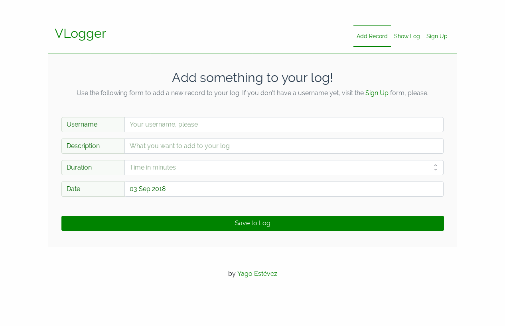

# EXERCISE TRACKER
#### A project made for APIs & Microservices Module at FreeCodeCamp
----

A project made for **APIs & Microservices Module** at FreeCodeCamp.

#### Screenshot

This is an implementation of a front-end using this API as a back-end. It was made in Vue 2 with Vue Router.

#### Try it
Check a real working example using this API on the following link.
[https://yagoestevez-exercise-tracker.glitch.me/](https://yagoestevez-exercise-tracker.glitch.me/)

---
[Yago Estévez](https://twitter.com/yagoestevez)